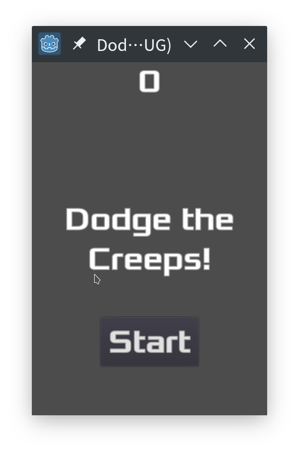

# Dodge the Creeps! CPP

Refactored [Godot Official Demo](https://docs.godotengine.org/en/stable/getting_started/step_by_step/your_first_game.html#) Using [GDNative](https://docs.godotengine.org/en/stable/tutorials/plugins/gdnative/gdnative-cpp-example.html)



## Prerequires

0. CMake
1. A C++ Toolchain (LLVM or GCC all OK) or Android NDK (If need to build to Android APP)
2. Godot Engine >= 3.1

## Build

Generate `api.json` of your `Godot` verson
```bash
godot --gdnative-generate-json-api api.json
```

Make a build folder
```bash
mkdir cmake-build
cd cmake-build
```

Get ready to make. Choose a build option.

Example 0. Make with default toolchain
```bash
cmake -DCMAKE_BUILD_TYPE=Release -DGODOT_CUSTOM_API_FILE=../api.json ..
```
Example 1. Make with Clang
```bash
CC=/usr/bin/clang CXX=/usr/bin/clang++ cmake -DCMAKE_BUILD_TYPE=Release -DGODOT_CUSTOM_API_FILE=../api.json ..
```
Example 2. Make with NDK (armeabi-v7a)
```bash
cmake -DCMAKE_BUILD_TYPE=MinSizeRel -DCMAKE_TOOLCHAIN_FILE=$ANDROID_NDK/build/cmake/android.toolchain.cmake -DANDROID_PLATFORM=android-28 -DANDROID_ABI=armeabi-v7a -DGODOT_CUSTOM_API_FILE=../api.json ..
```
Example 3. Make with NDK (arm64-v8a)
```bash
cmake -DCMAKE_BUILD_TYPE=MinSizeRel -DANDROID_TOOLCHAIN=aarch64-linux-android -DCMAKE_TOOLCHAIN_FILE=$ANDROID_NDK/build/cmake/android.toolchain.cmake -DANDROID_PLATFORM=android-28 -DANDROID_ABI=arm64-v8a -DGODOT_CUSTOM_API_FILE=../api.json ..
```

Then build.
```bash
cmake --build . -j5
```

Export.
See [Godot engine docs](https://docs.godotengine.org/en/stable/getting_started/workflow/export/index.html)